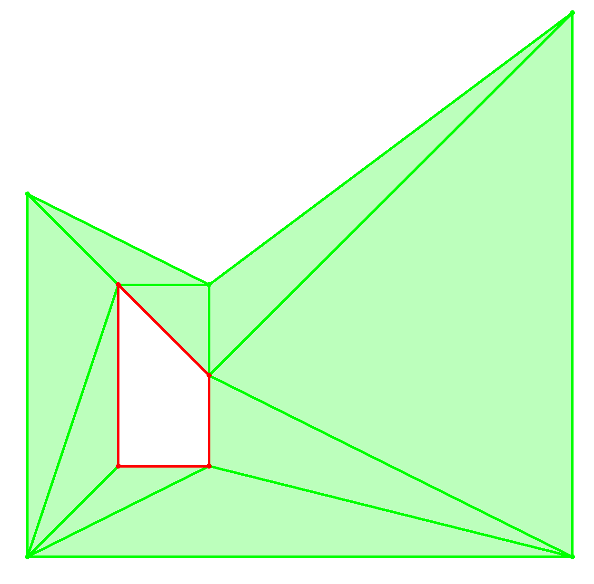

# Shapes

It is recommended to run the examples in this section in release mode, as the checks performed in debug mode can cause a significant slowdown.

## Plotting

To plot a 2D shape, you must create a 2D canvas object, plot any shapes, and run the canvas. A simple example is shown

```rust,no_run
use algebraeon::drawing::canvas::Canvas;
use algebraeon::drawing::canvas2d::Canvas2D;
use algebraeon::drawing::canvas2d::MouseWheelZoomCamera;
use algebraeon::geometry::parse::parse_shape;

let shape = parse_shape(
    "Polygon((0, 0), (6, 0), (6, 6), (2, 3), (0, 4)) \\ Polygon((1, 1), (2, 1), (2, 2), (1, 3))",
);

let mut canvas = Canvas2D::new(Box::new(MouseWheelZoomCamera::new()));
canvas.plot(shape);
canvas.run();
```

It produces the following plot, in an interactive 2D viewer:



Green areas indicate points that are part of the shape. Red area indicate points that are not part of the shape.

## Loading a Shape From a String

The supported syntax when loading a shape from a string:
 - `Point(<point>)`: A single point.
 - `Lines(<points>)`: The union of line segments connecting each consecutive pair of points in the list.
 - `Polygon(<points>)`: The closed polygon whose vertices are those given. Only works in 2D.
 - `PolygonInterior(<points>)`: The interior of the polygon whose vertices are those given. Only works in 2D.
 - `Loop(<points>)`: The union of line segments connecting each consecutive pair of points in the list, including the line segment connecting the first and last point.
 - `ConvexHull(<points>)`: The convex hull of the provided points.
 - `ConvexHullInterior(<points>)`: The interior of the convex hull of the provided points. The interior is taken with respect to the affine subspace spanned by the points.
 - `ConvexHullBoundary(<points>)`: The boundary of the convex hull of the provided points. The boundary is taken with respect to the affine subspace spanned by the points.
 - `ShapeA | ShapeB`: The union of shapes.
 - `ShapeA & ShapeB`: The intersection of shapes.
 - `ShapeA \ ShapeB`: The difference of shapes.
 - `ShapeA + ShapeB`: The Minkowski sum of shapes.